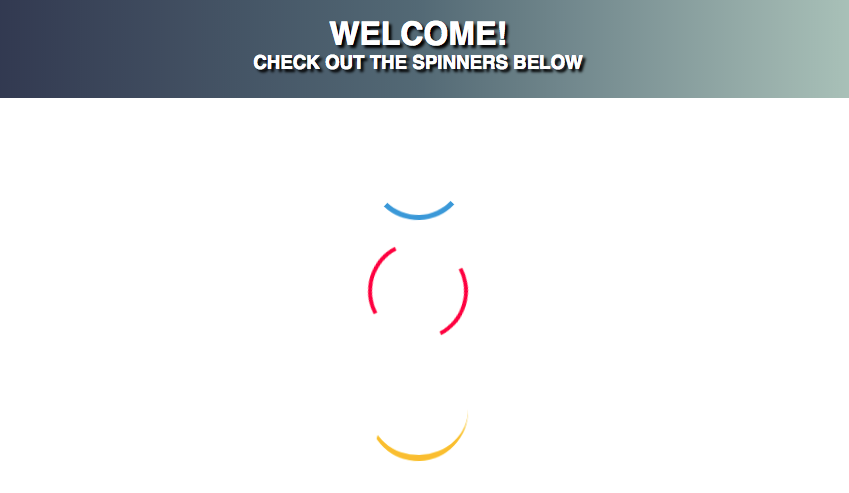

# Crash-Courses
Small Projects and Library/ Component testing

### JS Star Rating
- Star rating systems built with HTML, CSS, JavaScript, Font Awesome, and Bootstrap 4


### Drag & Drop JS
- Drag and Drop feature using vanilla JS


### Full Screen Image Carousel
- Fluid images on a carousel in HTML | CSS | JS


### Parallax Page
- Fixed scrolling images with HTML | CSS


### Google Maps API
- Google Maps API integration
- todo: work custom themes, symbols, shapes. Display extra data


### Coming Soon Landing Page
- styled countdown timer in HTML | CSS | JS
- resposive w/ media queries


### Custom CSS Spinner
- built using keyframes in CSS


### Split Screen Page
- HTML | CSS | JS
- JS DOM mouse moves reveal 2 layers, images made with GIMP


### Custom Responsive Menu Toggle
- HTML | CSS | JS
- transition toggle on svg reveals sidebar
- mobile responsive


### Gulp Tasks
- JS | Gulp
- basic tasks including image compression, minification of JS, Sass compilier
- example: minify js to dist/js folder using the gulp-uglify plugin
```js
gulp.task("minify", function() {
  gulp
    .src("src/js/*.js")
    .pipe(uglify())
    .pipe(gulp.dest("dist/js"));
});
```
- all tasks can be run under a single 'default' task with one command, e.g:
```js
gulp.task('default', ['message, copyHTML, imagemin, minify, sass'])
```

### Gulp and Sass
